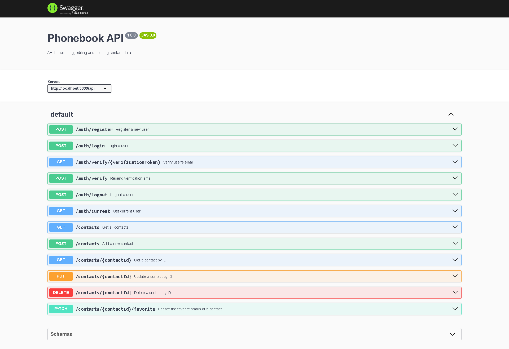

<h1 align="center">Phonebook backend</h1>

This is the backend application for
[Phonebook App](https://maryna-korbet.github.io/phonebook/), a
website for creating, editing and deleting contact data.

## Technologies

- **Node.js**
- **express**
- **mongoose**
- **swagger-ui-express**
- **bcrypt**
- **dotenv**
- **@sendgrid/mail**
- **cors**
- **cors-env**
- **jimp**
- **joi**
- **jsonwebtoken**
- **morgan**
- **multer**
- **gravatar**
- **nanoid**
- **yamljs**
- **nodemon**

## Installation

1. Clone the repository from GitHub:
   `git clone https://github.com/Maryna-Korbet/phonebook-backend`

2. Navigate to the project directory: `cd phonebook-backend`

3. Install the dependencies: `yarn`

4. Configure environment variables by creating a .env file in the root of the
   project and providing the necessary values. Refer to the .env.example file
   for the required variables.

5. Start the development server: `yarn start:dev`

6. This will start the backend server on the specified port (default is 5000)
   and establish a connection to the MongoDB database.

7. Access the backend APIs using the base URL `http://localhost:5000` (or the
   specified port).

## Swagger documentation

Documentation is available at `http://localhost:5000/api/docs/`

 
  

&#xa0;

## Get in Touch

If you have any questions or suggestions, please feel free to reach out to me through one of the following channels:

- **Email:** [korbet.maryna.developer@gmail.com](mailto:korbet.maryna.developer@gmail.com)
- **LinkedIn:** [Maryna Korbet](www.linkedin.com/in/maryna-korbet)

I am always happy to connect and chat!
